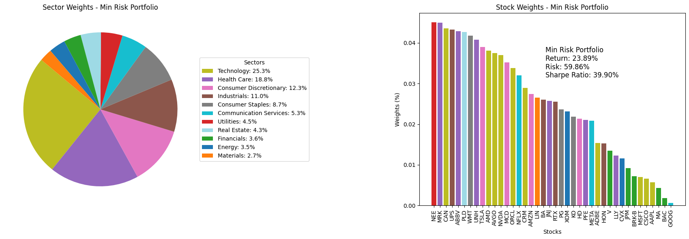

# Portfolio Optimization Using Python

This project aims to perform a comprehensive analysis of a selection of 40 stocks that represent the weight distribution by sector of the S&P 500 index. We evaluate various portfolios to understand the impact of different asset weights on the expected return, risk, and Sharpe ratio. The main objective is to compare the optimized portfolios (Max Sharpe Ratio, Max Return, and Min Risk) against the original distribution and derive insights on sector weighting's influence on portfolio performance.


*This pie chart illustrates the initial distribution of the 40 selected stocks across different sectors, mirroring the S&P 500's sector weighting. It provides a visual representation of the diverse sector composition before portfolio optimization, serving as a baseline for comparison with the optimized portfolios.*

## Project Breakdown:

- **Data Analysis**: Utilizes historical stock price data to calculate returns, risk, and correlations.
- **Portfolio Optimization**: Employs randomization to generate thousands of portfolio combinations and identifies optimal portfolios based on the Sharpe ratio, maximum return, and minimum risk criteria.
- **Visualization**: Provides intuitive visualizations, including an efficient frontier plot and pie/bar charts to illustrate portfolio compositions.

## Requirements
- Python 3.10
- Pandas
- NumPy
- Matplotlib
- yfinance

## Project Structure:
- **data/**: Contains the dataset with information about the selected stocks including symbols and sectors.
- **colors.py**: A Python script to manage the colors associated with different sectors in visualizations.
- **portfolio_plotter.py**: A Python module containing functions for creating portfolio visualizations.
- **portfolio-optimization.ipynb**: The main Jupyter Notebook containing the analysis, visualizations, and insights.

## How to Run the Project:
1. Clone the repository:
``` 
git clone https://github.com/Alfredomg7/PortfolioOptimization
``` 

2. Navigate to the project directory and install the required libraries:
``` 
cd PortfolioOptimization
pip install -r requirements.txt
```

3. Run the Jupyter Notebook:
``` 
jupyter notebook
``` 

4. Open the `portfolio-optimization.ipynb` notebook and run all cells.

## Visualizations

### Efficient Frontier


*This chart displays the efficient frontier, highlighting the portfolios with the highest Sharpe ratio (red star), maximum return (green triangle), and minimum risk (blue square).*

### Max Sharpe Ratio Portfolio


*The Max Sharpe Ratio Portfolio visualization reveals its sector distribution, emphasizing a strong allocation in technology. It also displays the top contributing stocks, indicating the portfolio's primary drivers of performance.*


### Max Return Portfolio


*This chart represents the Max Return Portfolio, showcasing its concentration in high-growth sectors like technology and Health Care.*

### Min Risk Portfolio


*The Min Risk Portfolio chart illustrates a more balanced sector allocation, aiming to minimize overall portfolio risk.*

## Conclusion
The project provides insights into the trade-offs between risk and return and the role of sector allocation in shaping a portfolio's performance. The Max Sharpe Ratio and Max Return portfolios are inclined towards the technology sector, indicating its significance in enhancing returns, while the Min Risk Portfolio is characterized by a more balanced sector distribution to mitigate risk.